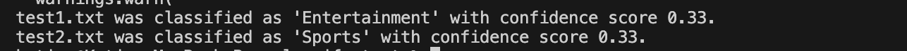

# Azure-lab

1. Question and answer lab


2. conversation language understandign lab: 


3. text classification - single label


4. openAi service

This lab has following steps: 
1. Deploy a base model : gpt-4o in this exercise, using Azure CLI
2. Install openAI SDK
3. Update .env file with endpoint, key and model's deployment name
4. First part: testing base model with different system message and prompt. As system message change and prompt provides mode details, the response gets more complex 
5. Second part: provide grounding.txt and add it into the messages_arr as user_message. Each assistant response is added into the messages_arr

Result of part 1: 


Result of part 2: 

#  submodules command
- add a submodule:
```bash
git submodule add <url> name_of_sub_module
```
- clone a submodule:
```bash
git clone --recurse-submodules
```
- turn a submodule to a normal files so its content showup on git
```bash
rm -rf .gitmodules
rm -rf .git/config
rm -rf module-name/.git
```
then add, commit, push like normal