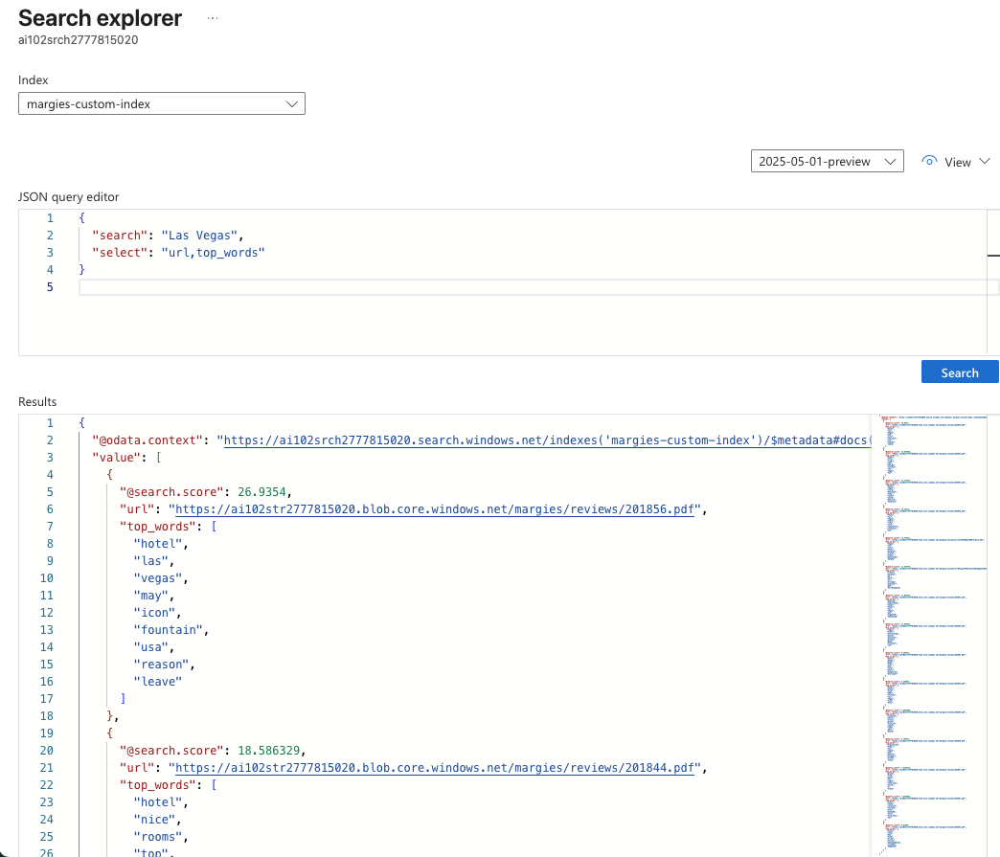
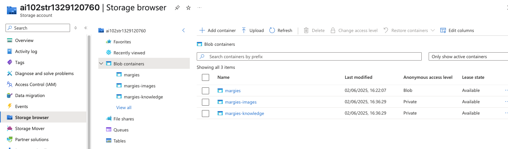

# Azure-lab

1. Question and answer lab


2. conversation language understandign lab: 


3. text classification - single label


4. openAi service

    This lab has following steps: 
    1. Deploy a base model : gpt-4o in this exercise, using Azure CLI
    2. Install openAI SDK
    3. Update .env file with endpoint, key and model's deployment name
    4. First part: testing base model with different system message and prompt. As system message change and prompt provides mode details, the response gets more complex 
    5. Second part: provide grounding.txt and add it into the messages_arr as user_message. Each assistant response is added into the messages_arr
Result of part 1: 


Result of part 2: 

5. Rag implementation


6. Implement manual AI search service with data source, index, skillset


7. Implement custom skill update with Function App


8. Implement knowledge storing with sharp skill



9. Implement document intelligence custom model- template model

#  submodules command
- add a submodule:
```bash
git submodule add <url> name_of_sub_module
```
- clone a submodule:
```bash
git clone --recurse-submodules
```
- turn a submodule to a normal files so its content showup on git
```bash
rm -rf .gitmodules
rm -rf .git/config
rm -rf module-name/.git
```
then add, commit, push like normal