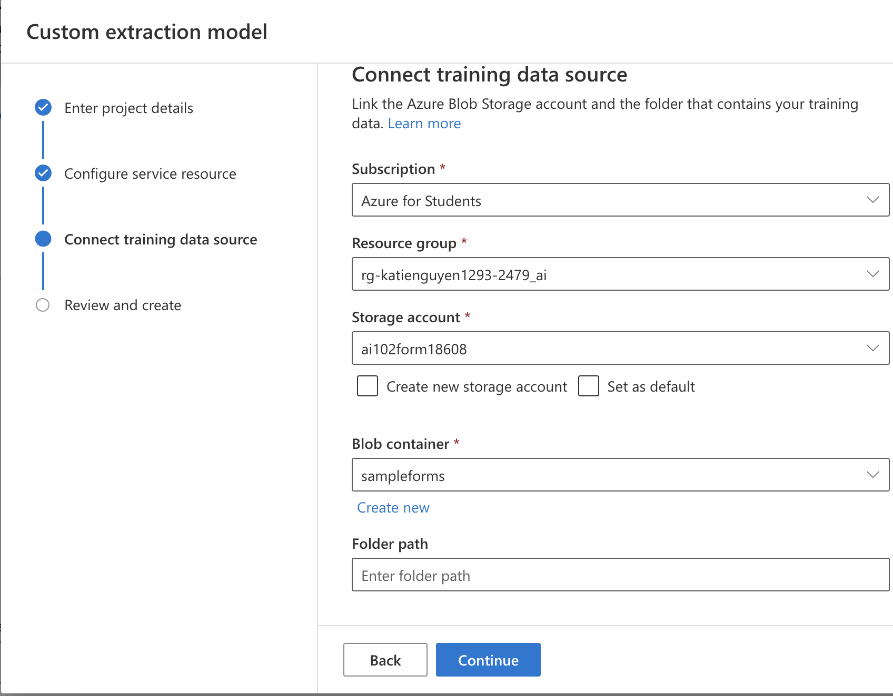
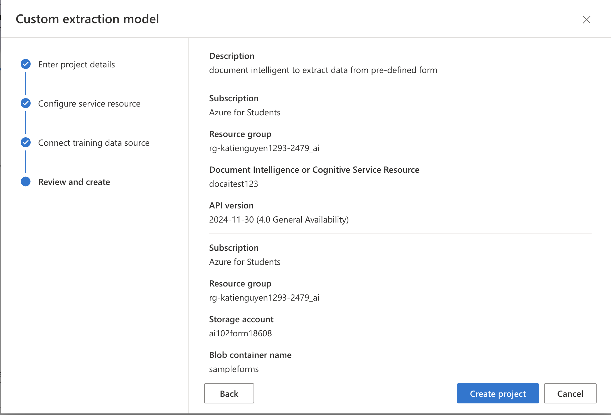
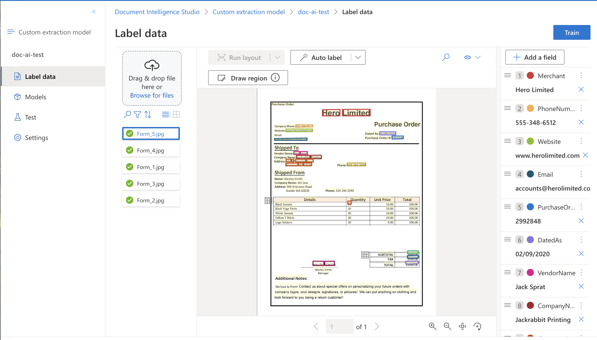
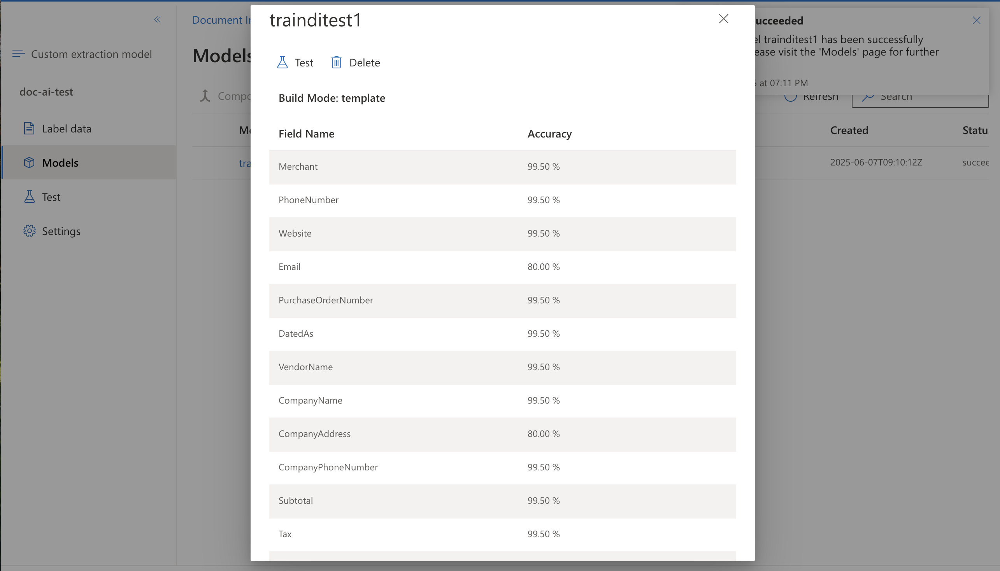

# mslearn-document-intelligence
Lab files for Azure AI Document Intelligence modules

1. Build a custom document intelligent model - template model

STEP 1: Create a resource for Document Intelligence in Azure portal
STEP 2: Go to setup.sh and fill in variable values: resource group name, resource id, location. This script will do following tasks:
    - create a unique id which will be a part of storage account name
    - create a new storage account resource under provided subscription, subscription group, location, 
    - once storage is created, get the key list where the first key is then saved into storage_key variable
    - create a new container with the access key and name it "sampleform"
    - batch upload all files from sample-forms to the container with the access key
    - geneate shared access signature for the container with both read and write permission to the blob container
    - print out the uri and sas of the container
STEP 3: In DI studio, create new project and fill up info
    - Link project to the di resource created in previous step: 
    
    - Link project to the blob container created in previous step:
    
    - Final review: 
    
STEP 4: Train the model inside project:
    - choose a unique model ID
    - Choose template models since we are dealing with a structured and consistent template. 
    
    - Model after training:
    
STEP 5: Test the trained model in Visual Code: 
    - populate DI resource key and uri, with the deployed model name. 
    - Now we are going to feed the test1.jpg to the model and print out the extracted info to console.
    - Print out: document type and fields with confidence score for each 
    - Result: 
    

