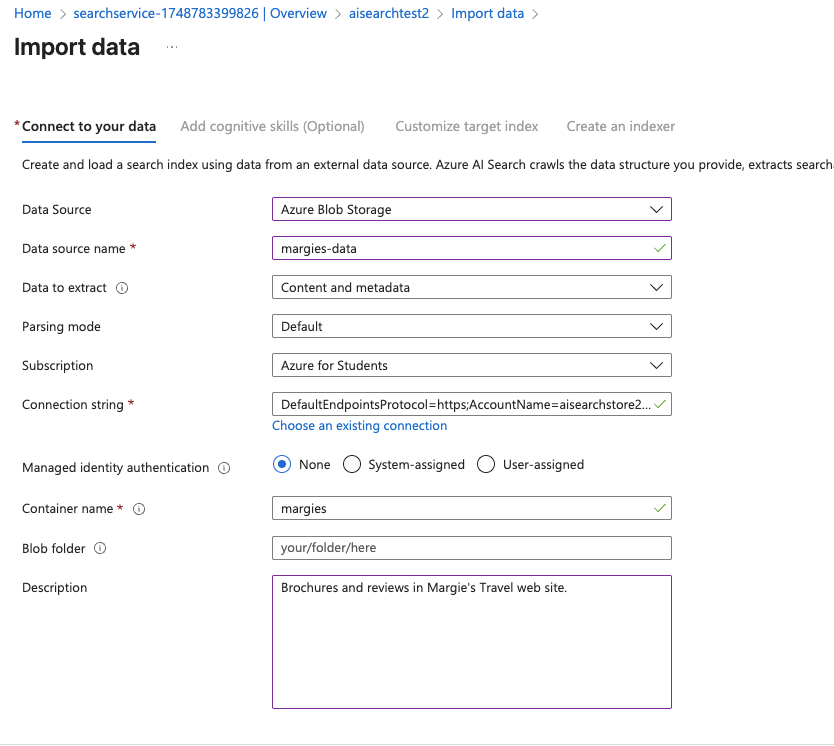
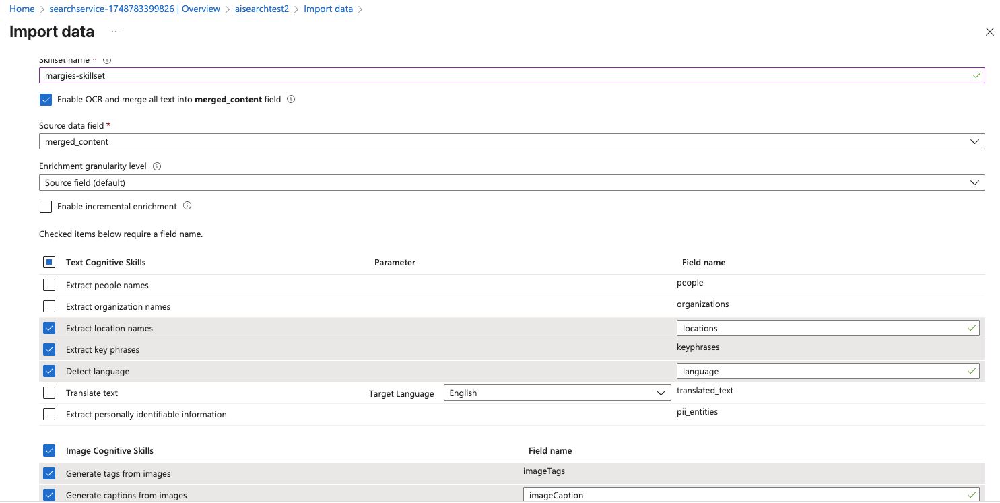
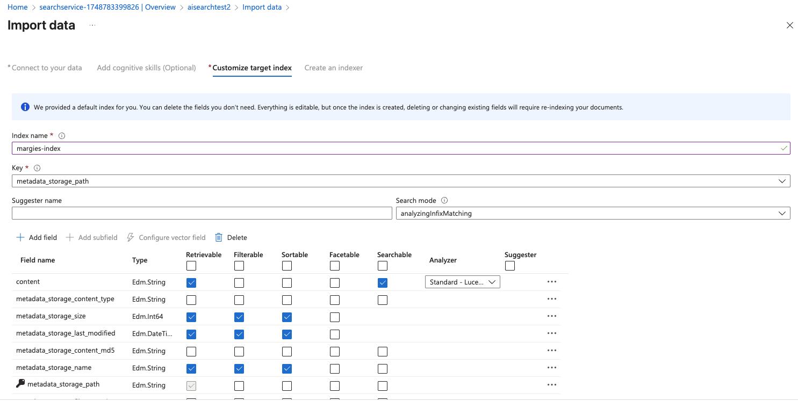
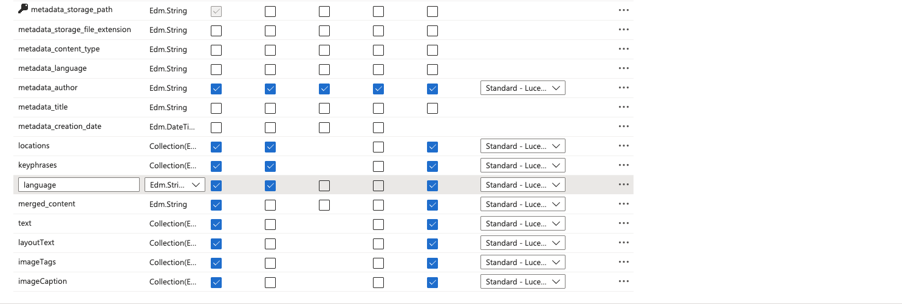
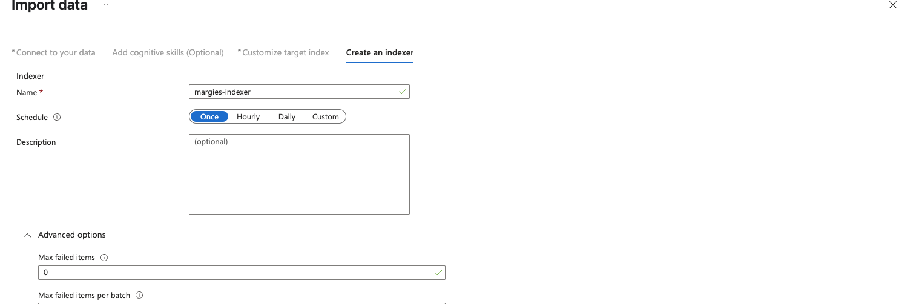
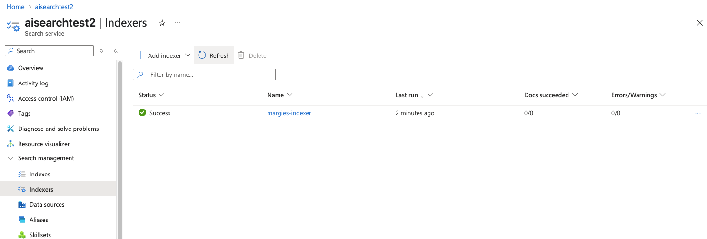
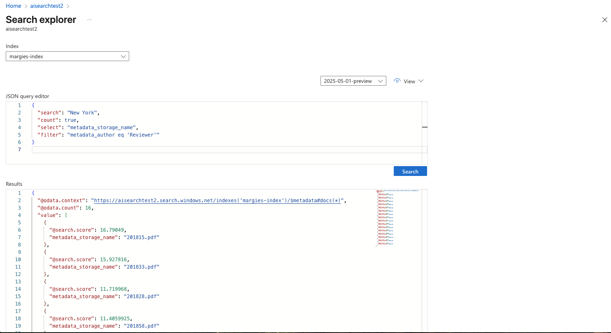
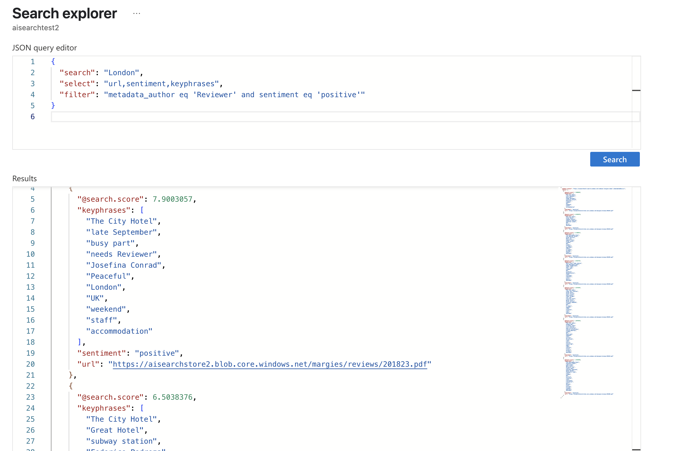

# mslearn-knowledge-mining
Lab files for Azure AI Knowledge Mining modules
1. Azure search
This lab we learn how to manually config AI search (which is different to RAG lab we use oepnAI embedding model!) which include config dataset, index, skillset, indexer. 
STEP 1: Create AI Search, AI Services, Blog Storage Account
STEP 2: Add values to variable in command file to upload data to the storage account
STEP 3: Sign in az login > change mode "chmod +x UploadDocs.sh" > run the command
STEP 4: Go to AI search resource > import data > pay attention to the connection string where we create connection between search service and the blob storage (existing connection)

STEP 5: Add skillset

STEP 6: Customize target index

STEP 7: Create indexer

STEP 8: run the indexer

STEP 9: Explorer

STEP 10: Modify search from local app with new definition of skillset, index, indexer
Test with Explorer: 

STEP 11: Install azure-search SDK and run code file
pip install azure-search-documents==11.5.1
flash run
STEP 12: Test the search website

2. Add custom skill
STEP 1: create AI services resource
STEP 2: run the script which do the following task:
    - Create a random unique id number
    - Create storage account whose name is ai102str${unique_id}
    - Get the storage key
    - Create a container inside the storage name "margies" with public access
    - Upload data from "data\" folder to "margies" container
    - Create a search service name ai102srch${unique_id} 
    - Show connection details to connect other apps: URL, admin keys, query keys
Verify if services are created successfully on the azure portal: 

