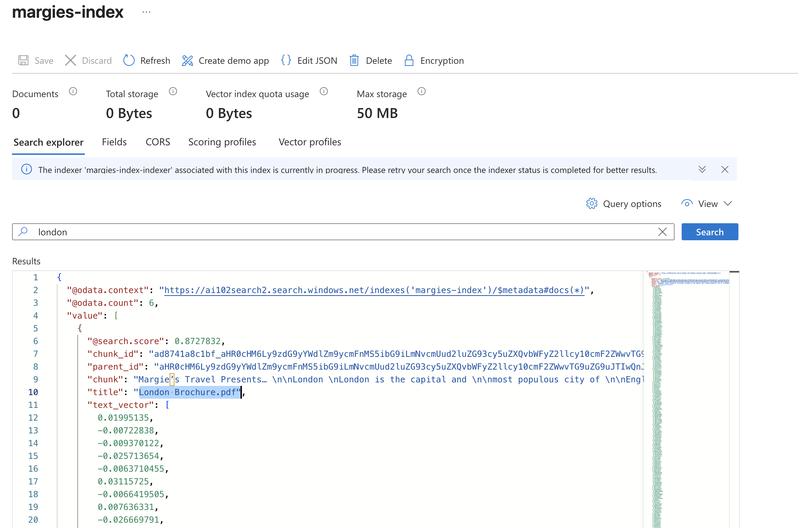

# RAG implementation lab
***NOTE***
This is done in lab environment so we implemented the simplest form of authentication which we use API key. The purpose of this lab is to understand how different AI services connected in RAG implementation:
Authentication Method: API Keys
Connection Type: Public Internet

How It Works:
  🔑 OpenAI SDK uses API keys directly
  🔑 You provide all keys/endpoints in code
  🔑 No managed identities needed
  🔑 No role assignments required
In production environment we will need to config RBAC and Vnet which will be in later projects

## STEP 1: Create resources
Create three resources: OpenAI, SearchAI and Blob storage account on azure portal
## STEP 2: Upload data
- Open storage account > storage brower > storage container > create a container > open the container > upload 
## STEP 3: Deploy AI models
- Deploy a text embedding model "text-embedding-ada-002" to vectorize the text in upload files 
- Deploy a GPT model "gpt-4o" to generate response
## STEP 4: Create an index
- Use text embedding model to turn text token in the index into numeric vector so it will be compatible with genAI 
- AI Search > Overview > Import and Vectorize data > Setup data connection > Azure Blob Storage > Vectorize your text > enable semantic ranking and schedule the indexer to run once > set the Objects name prefix

## STEP 5: Install OpenAI package in VScode
 pip install openai==1.65.2
## STEP 6: Config .env file
## STEP 7: Use SDK to create OpenAI Client
- Specify datasource to be of "azure-search" type  with authentication detais in " parameters"  including key, endpoint, search-index name